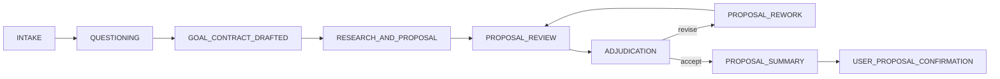
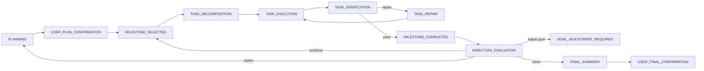

# Meta Flow Codex

Meta Flow is a Codex-native workflow for turning vague requests into clarified goals, reviewed proposals, adjudicated plans, concrete tasks, verified results, and direction-aware iteration.

## Install

Repo scope:

```bash
npx @bx-h/meta-flow@latest install --scope repo
```

Repo scope with automatic active-task resume:

```bash
npx @bx-h/meta-flow@latest install --scope repo --persistent
```

User scope:

```bash
npx @bx-h/meta-flow@latest install --scope user
```

Global CLI:

```bash
npm i -g @bx-h/meta-flow
meta-flow install --scope repo
```

Pinned version:

```bash
npx @bx-h/meta-flow@0.1.7 install --scope repo
```

## Quick Start

1. Install with repo or user scope.
2. Restart Codex.
3. In Codex, say:

```text
$meta-flow start: "I want to improve our backend observability but I'm not sure where to start."
```

To continue an existing task, say:

```text
$meta-flow resume
```

If you installed with `--persistent`, Codex will ask the controller for the current node before acting. Without `--persistent`, use `$meta-flow resume` when you want to continue.

You can check installation state with:

```bash
meta-flow doctor --scope repo
```

Meta Flow keeps runtime state in `~/.meta-flow/active-task.json`, `~/.meta-flow/task-index.json`, and `~/.meta-flow/tasks/<task-id>/` by default. Override with `META_FLOW_ROOT` or command-scoped `--root <path>` such as `meta-flow status --root <path>` only when you intentionally want an isolated runtime. The controller tells Codex the current workflow node and next action; users do not need to know internal phase names. Business artifacts live under stable by-node machine paths such as `artifacts/by-node/<order>-<phase>/<status>/<artifact>`, and `artifact-index.json` records the contract, hash, event, node, and retry metadata.

## When To Use It

- Vague requests.
- Multi-stage tasks.
- High-reliability implementation.
- Work that needs a proposal before execution.
- Work that needs task-level verification.
- Work where execution may reveal facts that require goal adjustment.

## When Not To Use It

- Questions answerable in one response.
- Tiny code edits.
- Tasks without definable acceptance criteria.
- Pure discussion with no observable artifact.

## Workflow

Proposal phase:



Execution phase:



## Roles

- `questioner`: clarifies ambiguity and drafts the goal contract.
- `researcher-proposer`: researches and writes the proposal.
- `reviewers`: product, technical, risk, and verification reviewers.
- `adjudicator`: resolves reviewer/user/direction feedback and routes the workflow.
- `proposal-summarizer`: writes the user confirmation summary.
- `planner`: creates milestone checkpoints.
- `direction-evaluator`: decides whether the goal and plan still hold.
- `task-decomposer`: creates concrete tasks for a milestone.
- `executor`: executes exactly one concrete task.
- `result-verifier`: verifies exactly one concrete task.
- `final-summarizer`: writes completion evidence, gaps, and residual risk.

## File Write Scope

Repo scope writes under the target repo:

- `<repo>/plugins/meta-flow`
- `<repo>/.agents/skills/meta-flow`
- `<repo>/.meta-flow/scripts`
- `<repo>/.meta-flow/templates`
- `<repo>/.agents/plugins/marketplace.json`
- `<repo>/.codex/agents/*.toml`
- `<repo>/.codex/config.toml`

User scope writes under the current user home:

- `~/.codex/plugins/meta-flow`
- `~/.agents/skills/meta-flow`
- `~/.meta-flow/scripts`
- `~/.meta-flow/templates`
- `~/.agents/plugins/marketplace.json`
- `~/.codex/agents/*.toml`
- `~/.codex/config.toml`

Task runtime data defaults to `~/.meta-flow/active-task.json`, `~/.meta-flow/task-index.json`, and `~/.meta-flow/tasks` regardless of repo or user install scope. It is not removed by uninstall.

## Uninstall

```bash
meta-flow uninstall --scope repo --yes
meta-flow uninstall --scope user --yes
```

Run a preview first:

```bash
meta-flow uninstall --scope repo --dry-run
```

## Safety

- No `postinstall` script modifies your system.
- The installer writes files only after explicit `meta-flow install`.
- `AGENTS.md` is changed only when `meta-flow install --persistent` is explicitly requested.
- No telemetry is collected.
- User code, config, and task content are not uploaded.
- Use `--dry-run` before installing.
- Existing unmanaged files are not overwritten unless `--force` is used.
- Overwrites support backups.
- Prefer pinned versions for reproducible installs.

## Codex Marketplace

You can also distribute the plugin through a Codex marketplace entry:

```bash
codex plugin marketplace add bx-h/meta-flow --ref v0.1.7
```

The npm installer still matters because it also materializes custom agent TOML files and validation scripts.

## Developer Docs

- [Architecture](docs/architecture.md)
- [Installation](docs/installation.md)
- [Publishing](docs/publishing.md)
- [Security](docs/security.md)
