> **一句话总结**：meta-flow 是一套 Codex-native 控制流，用分阶段提问、提案、评审、裁决、拆解、执行、验收和方向复盘，把模糊任务变成可确认、可执行、可回滚的落地流程。

# Meta-Flow

Meta-flow is for vague, multi-step, high-reliability work. It keeps discovery, proposal, review, routing, execution, verification, and user confirmation as separate control points.

It is intentionally not a LangGraph, CrewAI, or AutoGen setup. The default implementation uses:

- a Skill at `.agents/skills/meta-flow/SKILL.md`
- custom Codex agents under `.codex/agents/`
- state and artifact files under `.meta-flow/`
- standard-library Python validation scripts
- examples and documentation

## Why It Fits Vague Tasks

Vague requests fail when an agent jumps straight into execution. The common failure is not lack of effort; it is unclear target, unreviewed proposal, oversized tasks, no evidence standard, and no route back when new facts appear.

Meta-flow prevents that by forcing:

- explicit goal contract before proposal
- multiple reviewer viewpoints before user confirmation
- adjudication separate from mechanical review aggregation
- milestone planning separate from concrete task decomposition
- executor/verifier loops at concrete-task grain
- direction evaluation after milestones and major new findings

## Complete Stage Graph

```mermaid
flowchart LR
  A["INTAKE"] --> B["QUESTIONING"]
  B --> C["GOAL_CONTRACT_DRAFTED"]
  C --> D["RESEARCH_AND_PROPOSAL"]
  D --> E["PROPOSAL_REVIEW"]
  E --> F["ADJUDICATION"]
  F -->|revise| G["PROPOSAL_REWORK"]
  G --> E
  F -->|accept| H["PROPOSAL_SUMMARY"]
  H --> I["USER_PROPOSAL_CONFIRMATION"]
  I -->|accept| J["PROPOSAL_ACCEPTED"]
  I -->|reject| F
  J --> K["PLANNING"]
  K --> L["USER_PLAN_CONFIRMATION"]
  L --> M["MILESTONE_SELECTED"]
  M --> N["TASK_DECOMPOSITION"]
  N --> O["TASK_EXECUTION"]
  O --> P["TASK_VERIFICATION"]
  P -->|revise| Q["TASK_REPAIR"]
  Q --> O
  P -->|pass| R["MILESTONE_COMPLETED"]
  R --> S["DIRECTION_EVALUATION"]
  S -->|continue| T["CONTINUE_NEXT_MILESTONE"]
  T --> M
  S -->|replan| U["REPLAN"]
  U --> K
  S -->|adjust goal| V["GOAL_ADJUSTMENT_REQUIRED"]
  V --> B
  S -->|all done| W["FINAL_SUMMARY"]
  W --> X["USER_FINAL_CONFIRMATION"]
  X --> Y["DONE"]
```



## Agent Responsibilities

`questioner` clarifies vague input and drafts `questioning-report.json` plus `goal-contract.json`. It asks at most five high-value questions and should bias toward asking when uncertainty can change scope, acceptance criteria, risk, UX, dependencies, or implementation direction. Assumptions are reserved for truly low-impact gaps.

`researcher_proposer` reads the goal contract, code, and docs, then writes `proposal.md`. It gives a recommended route, alternatives, tradeoffs, risks, and validation plan. It does not write code or change the goal contract.

`product_reviewer` checks whether the proposal solves the user's goal and respects boundaries.

`technical_reviewer` checks feasibility, dependencies, complexity, architecture fit, and maintainability.

`risk_reviewer` checks safety, data, permission, destructive operation, rollback, compatibility, and operational risks.

`verification_reviewer` checks whether acceptance criteria are executable, observable, and repeatable.

`adjudicator` reads reviewer reports, mechanical aggregate, user feedback, and direction-evaluator output. It decides the route. It does not write code or directly edit proposals.

`proposal_summarizer` creates `proposal-summary.md` for user confirmation without adding new claims.

`planner` converts an accepted proposal into milestone checkpoints in `milestone-plan.json`.

`task_decomposer` breaks the current milestone into concrete tasks in `task-list.json` and writes the selected `task-spec.json`.

`executor` executes exactly one concrete task and writes `task-execution-report.json`.

`result_verifier` verifies exactly one concrete task and writes `task-verification-report.json`.

`direction_evaluator` checks whether the goal, proposal, and plan remain valid after a milestone or major new finding.

`final_summarizer` writes `final-report.md` with completed work, gaps, evidence, risks, and acceptance result.

Before any role is spawned, the controller requires a one-time `delegation_authorization` user gate. This records explicit task-level permission for sub-agents/delegation/parallel agent work, satisfying tool surfaces that require user authorization before spawning. Rejecting the gate blocks the workflow.

## Concrete Task Grain

Executor and verifier are concrete-task roles, not milestone roles. This is the main reliability boundary.

A milestone is a stage checkpoint such as "health endpoint implemented and documented." A concrete task is a small unit such as "add route handler and focused route test." If executor handles a whole milestone, it can silently expand scope. If verifier checks a whole milestone, failures become vague and repairs become broad.

Concrete-task grain gives:

- small allowed file sets
- clear acceptance checks
- bounded repair attempts
- focused evidence
- easier rollback

On a verifier `revise`, `TASK_REPAIR` is owned by `task_decomposer`: it updates or reselects one bounded `task-spec.json` from the verifier's minimal repair instructions, then the workflow returns to `TASK_EXECUTION` for the executor to run that spec.

## Adjudicator Versus Reviewers

Reviewers provide evidence and a local decision: `pass`, `revise`, or `block`. They do not route the workflow.

`aggregate_reviews.py` only performs mechanical aggregation:

- any block means mechanical result `block`
- otherwise any revise means `revise`
- otherwise `pass`

The adjudicator decides what the result means. A reviewer block may be valid, mitigated, or based on a misunderstanding. The adjudicator resolves conflicts, deduplicates issues, checks round limits, and chooses `accept`, `revise_proposal`, `ask_user`, `adjust_goal`, `replan`, or `block`.

## Direction Evaluator

Direction evaluation runs after each milestone and when verification finds a major new fact.

It asks:

- Does the original goal still hold?
- Did execution invalidate a proposal assumption?
- Did the milestone expose a new boundary?
- Are acceptance criteria still reasonable?
- Is user input required?
- Would continuing waste effort or create wrong output?

It may route to continue, replan, adjust goal, ask user, or abort. It can propose a goal-contract patch, but user confirmation is required before the goal changes.

## User Confirmation Gates

There are two mandatory human gates:

- `USER_PROPOSAL_CONFIRMATION`: after `proposal-summary.md`
- `USER_FINAL_CONFIRMATION`: after `final-report.md`

There is also a plan confirmation gate:

- `USER_PLAN_CONFIRMATION`: after `milestone-plan.json`

These are gates, not agents. Do not represent them as subagents.

## File Structure

```text
.agents/skills/meta-flow/
  SKILL.md
  references/

.codex/agents/
  questioner.toml
  researcher-proposer.toml
  product-reviewer.toml
  technical-reviewer.toml
  risk-reviewer.toml
  verification-reviewer.toml
  adjudicator.toml
  proposal-summarizer.toml
  planner.toml
  direction-evaluator.toml
  task-decomposer.toml
  executor.toml
  result-verifier.toml
  final-summarizer.toml

.meta-flow/
  templates/
  scripts/
  tasks/
  examples/sample-task/
```

## State Machine

`state.json` is the routing source of truth. It stores the task id, phase, status, round counters, current milestone, current task, last route decision, and history.

Important counters:

- `proposal_review_round`
- `direction_adjustment_round`
- each task's `repair_attempts`

Important limits:

- proposal rework: max 3 rounds
- task repair: max 2 rounds
- direction adjustment: max 2 rounds

## Loops And Stop Conditions

Proposal review failure:

```text
PROPOSAL_REVIEW -> ADJUDICATION -> PROPOSAL_REWORK -> PROPOSAL_REVIEW
```

User rejects proposal:

```text
USER_PROPOSAL_CONFIRMATION -> ADJUDICATION -> QUESTIONING | RESEARCH_AND_PROPOSAL
```

Task verification failure:

```text
TASK_VERIFICATION -> TASK_REPAIR -> TASK_EXECUTION -> TASK_VERIFICATION
```

Direction drift:

```text
DIRECTION_EVALUATION -> GOAL_ADJUSTMENT_REQUIRED -> QUESTIONING | RESEARCH_AND_PROPOSAL
```

Plan problem:

```text
DIRECTION_EVALUATION -> REPLAN -> PLANNING | TASK_DECOMPOSITION
```

When a limit is exceeded, write a blocked report and ask the user to decide.

## Adding A Reviewer

1. Add `.codex/agents/<new-reviewer>.toml`.
2. Give it `name`, `description`, `sandbox_mode = "read-only"`, and `developer_instructions`.
3. Require `reviewer-report.json` output with the standard schema.
4. Update the Skill reviewer invocation list.
5. Update docs and any orchestration notes.
6. Keep adjudication separate. A new reviewer does not get route authority.

## Adding A Verification Method

1. Add the method to `VALID_METHODS` in `.meta-flow/scripts/validate_goal_contract.py`.
2. Update `.meta-flow/templates/goal-contract.json` examples if needed.
3. Describe what evidence is required.
4. Update `verification_reviewer` instructions if the method needs special scrutiny.
5. Keep methods observable and repeatable.

## Example Walkthrough

The sample task lives at `.meta-flow/examples/sample-task/` and uses the request:

```text
为一个后端项目增加健康检查接口，并确保它有测试和文档。
```

Walkthrough:

1. Raw request is captured in `raw-request.md`.
2. `questioner` either opens a clarification gate for meaningful questions, or records low-impact assumptions and drafts `questioning-report.json` plus `goal-contract.json`.
3. `researcher_proposer` writes a shallow `GET /healthz` proposal.
4. Four reviewers pass the proposal and add scoped suggestions.
5. `aggregate_reviews.py` writes `review-aggregate.json`.
6. `adjudicator` accepts and routes to proposal summary.
7. `planner` creates one milestone.
8. `task_decomposer` creates one concrete task.
9. `executor` records sample implementation evidence.
10. `result_verifier` passes the concrete task.
11. `direction_evaluator` finds no drift and routes to final summary.
12. `final_summarizer` records completed work and residual risk.

## Common Failure Modes

Silent questioning skip: questioner records meaningful questions as non-blocking assumptions and advances without asking the user. Put meaningful questions in `clarifying_questions`; the controller requires a `clarifying_questions` gate before `goal_contract_drafted`.

Infinite questioning: questioner asks low-value questions instead of separating meaningful questions from low-impact assumptions. Limit to five high-value questions.

Generic reviewers: reviewers say "looks good" or "consider edge cases" without evidence. Require concrete issue lists and evidence refs.

Executor expands scope: executor edits files outside `allowed_files` or solves a larger problem than the task spec. Mark blocked instead.

Verifier writes code: verifier fixes the task while checking it. It must only report pass, revise, or block.

Milestone too large: planner creates a milestone that cannot be verified or rolled back. Split it.

New facts ignored: verifier finds a goal-changing fact but no direction evaluation runs. Set `should_trigger_direction_evaluation = true`.

User confirmation overload: proposal summary dumps every detail. Summarize what will be done, what will not, why, risk, and exact confirmation needed.

## Commands

Create a task:

```bash
meta-flow start "<raw request>"
```

Validate artifacts:

```bash
meta-flow validate goal-contract <task-dir>/artifacts/by-node/03-GOAL_CONTRACT_DRAFTED/done/goal-contract.json
meta-flow aggregate-reviews --reviews-dir <task-dir>/reviews --output <task-dir>/review-aggregate.json
meta-flow validate adjudication <task-dir>/artifacts/by-node/06-ADJUDICATION/done/adjudication-report.json
meta-flow validate milestone-plan <task-dir>/artifacts/by-node/10-PLANNING/done/milestone-plan.json
meta-flow validate task-list <task-dir>/artifacts/by-node/12-TASK_DECOMPOSITION/done/task-list.json
meta-flow validate task-verification <task-dir>/artifacts/by-node/14-TASK_VERIFICATION/done/task-verification-report.json
meta-flow artifacts validate <task-id>
meta-flow status <task-id>
```
